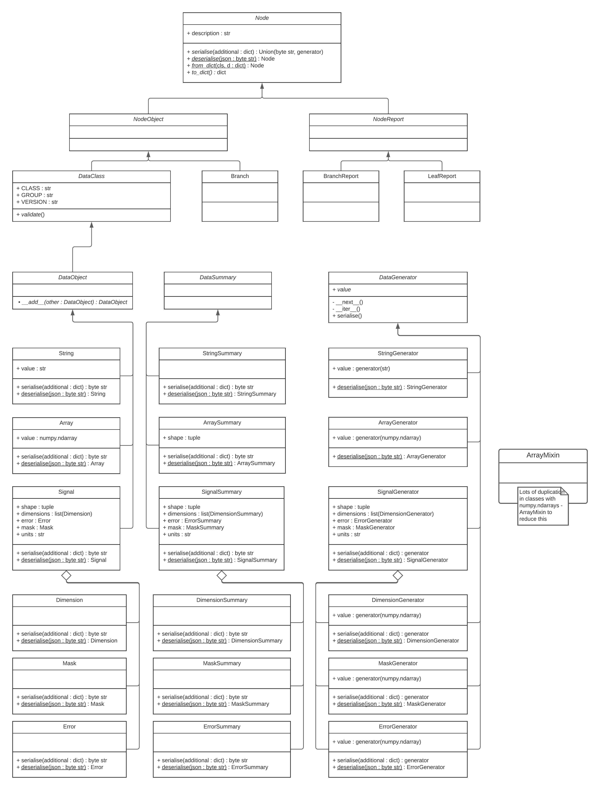

# Large Data Access

## Goals

Enable a SAL server to respond to a client `get` operation on a leaf node which contains a large (>200 Mb) `DataObject`.  This should be done without changing the SAL client API, and should minimize the memory demands on the server.

### Definitions
`get`: One of the SAL operations (`list, get, copy, put, delete`) for interacting with a node.  **This is not equivalent to an HTTP GET request.**

large `DataObject`: An instance of a subclass of a SAL `DataObject` which is > 200 Mb.

## Requirements

- Client `get` operation should be independent of node size i.e., it should not require additional parameters or headers to be passed.  The client should not need to know if they are getting data from a node with a large `DataObject`. 
- A large `DataObject` is assumed to fit within client-side memory.
- The client should return an existing `DataObject` subclass.

## Architecture

### Overview
In addition to the current response from `get` operations, the server will respond with chunked transfer encoding for large data.  This is achieved by returning a `Response` object with a generator which yields the JSON representation of the large data (and any additional fields which define the `DataObject`).  Therefore the backend data will need to be requested within a generator.  The suggested approach will modify the server `get` operation, the client `get` operation, and the `DataObject` and it's subclasses.

**Server changes**

- Change `DataTree.get` to return a `flask.Response` object, rather than a `dict`.  A `flask.Response` object can take either byte string or generator representations of JSON for the `response` parameter: this parameter will be provided with `to_json` from a `Node` subclass.

**Core and dataclass changes**

The current architecture of objects which can be returned from nodes (`Branch`, `BranchReport`, `LeafReport`, `DataObject` and it's subclasses) has two issues:
    
1. While all four base classes list above can be returned from a GET request, they do not share a common interface.  While they effectively implement a common interface, it would be preferable for this to be defined.

2. There is a signficant amount of code duplication, which is particularly prevalent with `SummaryObject` subclasses and 'DataObject' classes which contain `numpy.ndarray` objects.

A summary of suggested changes to the architecture are:

- Create abstract base class `Node` for the four different responses from nodes.
- Add abstract `to_dict` and `from_dict` to `Node` (from the subclasses).
- Move serialisation from serialise.py functions into `Node` and its subclasses.  `serialise` will either return either a byte string or generator representations of JSON. The generator representation is required for Flask to respond with a chunked transfer encoding.  `serialise` will also take a parameter (`additional`, although name may be changed) which will enable additional data to be added before the object is serialised.  This will allow the `url`, which is currently added within `DataTree.get` to be added to the `Response`.
- Create abstract base classes `NodeReport` (`BranchReport`, `LeafReport`) `NodeObject` (`Branch`, `DataObject`), which will unify common serialisation behaviour.

As a few [data classes](https://simple-access-layer.github.io/documentation/datamodel/dataclasses.html) will require significantly differnet serialisation, this will be handlded on a per class basis, with classes inheriting from `DataGenerator`.  `DataGenerator` will also define a concrete `serialise` method for the typical serialisation (e.g. for `StringGenerator`).  Each `DataGenerator` subclass will take a generator as a `value`, which will be used for serialisation.  `DataGenerator` subclasses will also be added to the `DataClass` registry, and the corresponding `DataSummary` will be used as the summary class (e.g., `StringSummary` as the summary class for `StringGenerator`).

An abstract `__add__` will also be added to `DataObject`, as the concrete implementations will be used to combine chunked data.

**Client Changes**

- The client `get` operation will have an additional decoding for chunked transfers.  This will use `DataObject.__add__` for combining the chunks. 

### UML class diagrams

Class diagram only includes significant additions/modifications to current classes.



### Server Responses

The current success response from a leaf node is:

```http
Status Code: 200 OK
Content-Type: application/json
Content-Length: <LENGTH>

{
    "content": "object",
    "type": "leaf",
    "object":
    {
        <ENCODED_OBJECT>
    },
    "request":
    {
        "url": <REQUEST_URL>
    }
}
```

This would change to:

```http
Status Code: 200 OK
Content-Type: application/json
Content-Length: <LENGTH>

{
    "content": "object",
    "type": "leaf",
    "object":
    {
        <ENCODED_OBJECT>
    }
}
```

In addition there will be a new chunked response:

```http
Status Code: 200 OK
Content-Type: application/json
Transfer-Encoding: chunked

{
    "content": "chunked_object",
    "type": "leaf",
    "chunked_object":
    [
        <ENCODED_OBJECT1>,
        <ENCODED_OBJECT2>
    ]
}
```
where each `<ENCODED_OBJECT>` is a JSON representation of a complete object (i.e. equivalent to what is in the `object` field in the current request).


## Constraints

- REST API
- What is supported by `flask` and `flask_restful`
- Achievable using JSON
- `DataClass` architecture

## Issues with suggested approach

- `Transfer-Encoding` header only supported in HTTP 1.1
- Client side decoding will be less elegant.
- Multiple return types from `deserialise`.

## Alternative Approaches

- Client side chunking using `Range` header
- Partial JSON objects
- `PersistenceProvider.get` has additional return of generator, which is then converted to JSON within `DataTree.get` (or function called from `DataTree.get`).
- A container class rather than `DataGenerator` subclasses.  This might be problematic because `serialise` would have to vary for different `DataObject` subclasses contained by the container class (particularly `Signal`, as it has to contain multiple generators).  
