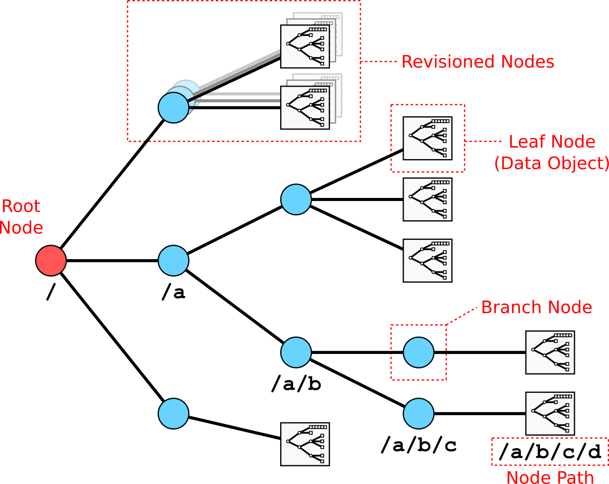

Data Tree
=========

The data stored in SAL is organised in a tree structure, much like a computer file system. This organisational structure is referred to as the data-tree and is constructed from branch and leaf nodes. Branch nodes are the equivalent of folders in a file-system, they are organisational elements and can contain other branches and leaf nodes. Leaf nodes hold data and are the equivalent to files in a file-system.

   The SAL data tree.

All the nodes in the data-tree can be given description strings to allow users to document their data directly in the data system.

The entire data-tree or elements within it may support revisions, allowing users to revise data while maintaining access to historical versions of data stored under a node name.

Nodes
-----

Data tree nodes are either branch or leaf nodes. All nodes have a name that uniquely identifies them from its siblings in their branch of the data-tree.

Branch nodes hold a UTF8 description string and a list of child leaf and branch nodes. The node list is modified by the system when the user performs an action on the data-tree such as creating or removing a node. The description is directly configurable by the users.

Leaf nodes consist of a single instance of a SAL data-class (see :ref:`data-model-data-classes`). Leaf nodes hold two representations of a data-class instance, the full data object and a reduced representation known as a summary object. The summary object is automatically generated from the full object by the system.

Both branch and leaf nodes may be revisioned (see :ref:`data-model-revisions`).

Naming
~~~~~~

All nodes have a string name. Node names must consist of only the following characters::

   abcdefghijklmnopqrstuvwxyz0123456789-_.

To simplify user interaction, the SAL interface is case-insensitive. Upper-case characters are transparently converted to lower-case by the user facing APIs.

.. _data-model-revisions:

Revisions
~~~~~~~~~

The SAL data model supports the concept of data revisions. Revisioned nodes/trees maintain their entire history of writes and modifications.

The revision system is modelled on the design of the Subversion version control system. Each revision of the data written to a node is referred to by a revision number. The revision number is an integer that increases as newer data is written. The latest data or ``head`` revision of a node is therefore the revision with the highest number. The earliest revision number in the system is 1. Revision 0 is a special revision that always points to the head revision of the node (see :ref:`data-model-pathing`).

The SAL data model does not prescribe a specific revision system. It is up to the persistence layer implementation how node revisions are handled. The only requirement is that the revision number of an individual node increases as new data is written to the node. This increase does not need to be consecutive.

Persistence layers may implement:

* Full tree revisioning:
   * The organisational structure and data are revisioned.
   * The revision number is global property of the tree.
   * Users can see how the tree looked at any point in history.

* Sub-tree revisioning:
   * As above, but localised to particular sub-tree(s) in the data-tree.
   * The revision number is a global property of the sub-tree.
   * Typically seen if SAL is being used to wrap existing systems that support only limited forms of revisioning.

* Node revisioning:
   * The organisation of the tree is fixed.
   * The revision number is a local property of the node.
   * All the nodes are independently revisioned.

.. _data-model-pathing:

Pathing
-------

The location of a branch or leaf node in the data-tree is specified using a POSIX filesystem-like path. A path starts with a forward slash, followed by a list of the branch names from the root of the tree to the required node (in order of navigation) separated by forward slashes. An absolute path consisting of a single forward slash refers to the tree root. A typical path for data would look as follows::

   /pulse/87737/ppf/signal/jetppf/magn/ipla

Each node in the data-tree can have multiple revisions, by default only the most recent or head revision is visible. To obtain a specific node revision, a colon followed by the revision number are appended to the node path. For instance::

   /pulse/87737/ppf/signal/jetppf/magn/ipla:23

This path points to revision 23 of the ``ipla`` leaf node. For users that desire to be explicit about specifying the head revision, this can be referred to using either ``<path>:0`` or ``<path>:head``.

.. _data-model-data-classes:

Data Classes
------------

The data stored on leaf nodes are known as data objects. These are discrete bundles of data conforming to one of a number of pre-defined structures known as data classes. Each leaf node contains a single data object. Users can request either the full data object or a reduced summary object that contains only the meta-data.

Data classes are intended to represent a particular type of data, such as time traces, camera images or 3D meshes. Data classes are validated server side to ensure consistency of the data. See :ref:`data_classes` for the concrete definition of the data classes provided by SAL.

A data object is a tree structure consisting of branch and leaf nodes, much like the data tree. The leave nodes are values of atomic types or containers of values that are representable in all modern programing languages. Each node is named and follows the same conventions as the data tree, names are limited to the following characters::

   abcdefghijklmnopqrstuvwxyz0123456789-_.

A set of names are reserved for use by the SAL system (see :ref:`data_model_common_structure`)

Types
~~~~~

All data class structures are built from the following basic types.

**Atomic**

* Signed integer: ``int8``, ``int16``, ``int32``, ``int64``
* Unsigned integer: ``uint8``, ``uint16``, ``uint32``, ``uint64``
* Floating point: ``fp32``, ``fp64``
* Boolean: ``bool``
* String: ``string``

Strings are encoded as UTF8.

**Container**

* N dimensional array: ``array<TYPE>``

Where array type is any one of the atomic types.

* Branch: ``branch`` / ``{}``

The branch type is equivalent to a Python dictionary with string keys.

**Special**

* ``null``

When an attribute is labelled as optional, ``null`` is used inplace of missing content.

Representations
~~~~~~~~~~~~~~~

Data classes are defined by specifying the two representations of the data object - the full data object and it's associated summary object.

The full object is the complete data class containing all data. These objects can potentially be very large when fully populated with data (>100MB).

The summary object has the same tree structure as the full object except the nodes containing the bulk data are either removed or replaced with a reduced representation. The purpose of the summary object is to allow users to interrogate the available data without needing to pull down the whole object. Summary objects must remain small (~1kB) as the user will potentially pull down many summary objects before deciding to download a full data object.

Notation
~~~~~~~~

To define data classes in this document we use the following notation.

Objects::

    object: {
        $CONTENTS
    }

Branches::

    $NAME: {
        $CONTENTS
    }

Atomic types::

    $NAME: $TYPE = $CONTENTS

Arrays::

    $NAME: array<$TYPE> = $CONTENTS

An attribute that is considered optional is enclosed with square brackets::

    [$NAME: $TYPE = $CONTENT]

.. _data_model_common_structure:

Common Structure
~~~~~~~~~~~~~~~~

Both the full object and the summary objects share a common structure around which the data class is defined. This structure defines a class name, a group the class belongs to, whether the object is a full or summary object, its version, and finally a text description string::

    object: {
        _class: string = $CLASS_NAME
        _group: string = $GROUP_NAME
        _type: string = $OBJECT_TYPE
        _version: uint64 = $CLASS_VERSION
        description: string = $DOC_STRING
    }

CLASS_NAME
   The string that identifies the data class (e.g. scalar, dictionary, signal). The name must conform to the same character list as the node names.

GROUP_NAME
   The string that identifies the group this data class belongs to (e.g. core, signal). The name must conform to the same character list as the node names.

OBJECT_TYPE
   Defines if this object is a full object or a summary object. Can only be set to the strings 'full' or 'summary'.

CLASS_VERSION
   This is the version of the data class definition.

DOC_STRING
   A human readable description of the object contents. All objects in SAL must have a description.

All underscored attributes must be populated by the developer when defining a new class. The description attribute is populated by the user when they create a data object along side other attributes in the class.

Data classes belong to a group. The intention behind the grouping is to aid user understanding by grouping together objects that have similar properties and/or concepts. However, please note that this is not a formal object system, there is no enforcement of sub-classing.

All data classes must be versioned if any attributes change, particularly if that change is incompatible with the previous version. This is to ensure that client side software can easily detect and handle changes to object definitions. If a change occurs the version number must be incremented.

Data class attributes may be optional. An optional attribute will still appear in the object but the contents will take a null value if the attribute is unused.

See :ref:`data_classes` for concrete data class definitions.

Operations
----------

The following operations are defined for the data-tree.

List
~~~~

Returns node meta data at the specific path.

The data returned depends on the type of node pointed to by the path.

For branch nodes the following attributes are returned:

  - the description
  - the list of child branch nodes
  - the list of child leaf nodes with associated data object id data i.e. class, group, version
  - head revision number
  - returned revision number
  - list of all available revision numbers

For leaf nodes the following attributes are returned:

  - the description
  - the data object id data: class, group, version
  - head revision number
  - returned revision number
  - list of all available revision numbers

Get
~~~

Returns node data for the specific path.

The data returned depends on the type of node pointed to by the path.

For branch nodes the description attribute is returned.

For leaf nodes the data object is returned. The user can request either the summary representation or full representation of the data object.

Put
~~~

Creates or updates branch and leaf nodes on the specific path.

A new node can only be created as a descendant of an existing branch node. To create a branch node a node name and a description must be supplied. To create a leaf node a node name and data object must be supplied.

Overwriting an existing branch node with a branch will update the node description without affecting the descendant nodes - the children will remain in place. All other operations will result in the original node being replaced by the new node.

Copy
~~~~

Copies the sub-tree specified by the source path to the target path location.

The destination sub-tree will be entirely replaced with the source sub-tree.

Delete
~~~~~~

Delete the entire sub-tree specified by the path.

Permissions Tree
================

A persistence layer may support the ability to set access permissions on object in the data-tree. Where this is implemented, a parallel permissions tree will be accessible. The organisation of the permissions tree mirrors the head revision of the data tree hierarchy.

Operations
----------

The following operations are defined for the permissions-tree.

Get
~~~

Put
~~~
